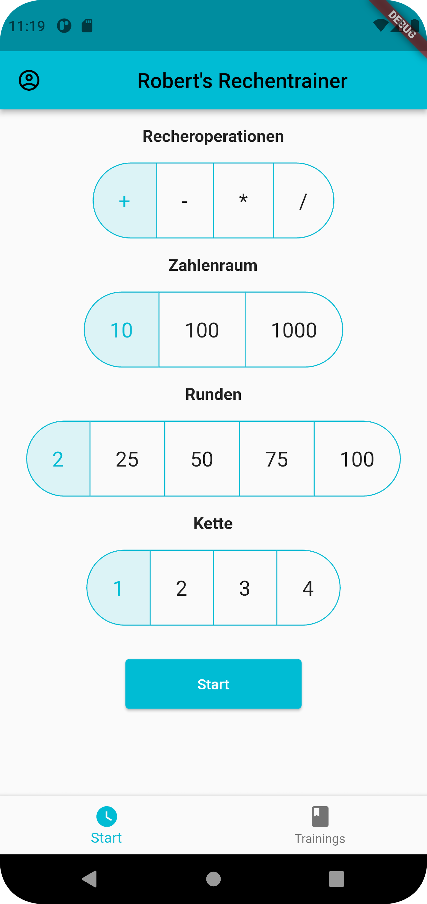
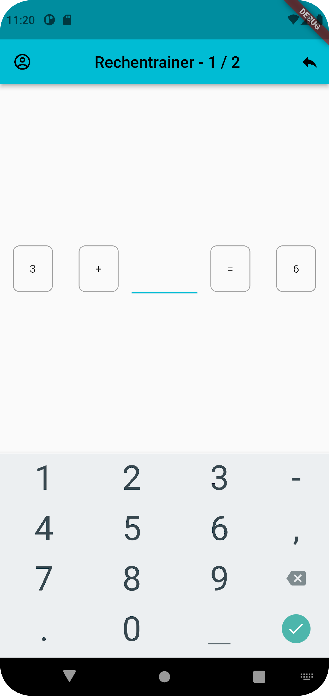
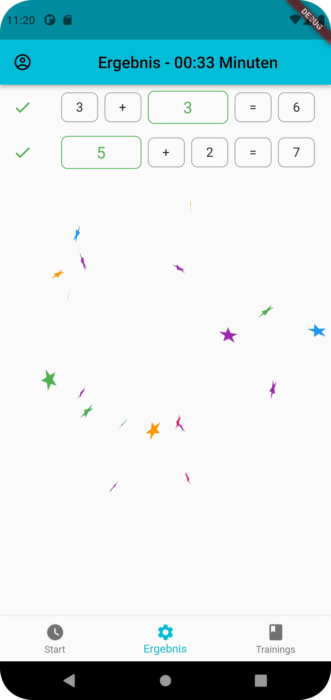
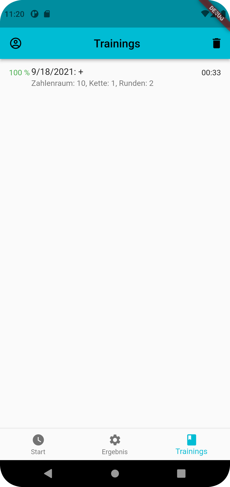

# Rechentrainer

[](https://github.com/digitalkaoz/rechentrainer/actions/workflows/ci.yml)

> train some basic math equations on time for kids!

[Web Version](http://digitalkaoz.github.io/rechentrainer)

[](./assets/screenshots/android_phone/users_set.png)
[](./assets/screenshots/android_phone/configuration.png)
[](./assets/screenshots/android_phone/calculation.png)
[](./assets/screenshots/android_phone/result.png)
[](./assets/screenshots/android_phone/history.png)

## Features

* Crossplattform (ios/android/web) Controls
* Extensive Test Suite
* randomized equations using [`petitparser`](https://github.com/petitparser/dart-petitparser)
* [Mobx](https://mobx.netlify.app/) for state managment
* multiple users (with own configurations and results)
* Storing results and users on device using [localstore](https://pub.dev/packages/localstore)
* some confetti animations for the results using [confetti](https://pub.dev/packages/confetti)

### Basic Algebra Generator

> at first, thanks for this awesome library!

The `petitparser` allows us to generate a parser for basic algebra.
We defined only basic arithmetics `+`, `-`, `*`, `%`.
The library is then able to solve equations from string like `5 + 4 * 2`.

We can configure the Generator with the following constraints:

* `range`: the *Zahlenraum*, means the upper boundary for the equation like `100`, all equation results wont exceed this boundary
* `arithmetics`: the arithmetics to use, can be one or all of the defined arithmetics, giving `+` would only generated equations with `+`
* `chain`: how many arithmetics to include, `2` means use 2 random arithmetics like `1 + 2 + 3`, while `1` would result in equations like `2 * 3`
* `count`: how many training sets to be generated

## Development

```shell
$ flutter pub get
$ flutter packages pub run build_runner build --delete-conflicting-outputs
```

## Testing

```shell
$ flutter test
```

or for running Integation-Tests:

```shell
$ flutter drive   --driver=integration_test/integration_test_driver.dart   --target=integration_test/app_test.dart   -d <DEVICE_ID>
```

> tests working cross platform too!

## Deployment

> testing and releasing works in *Github-Actions*


